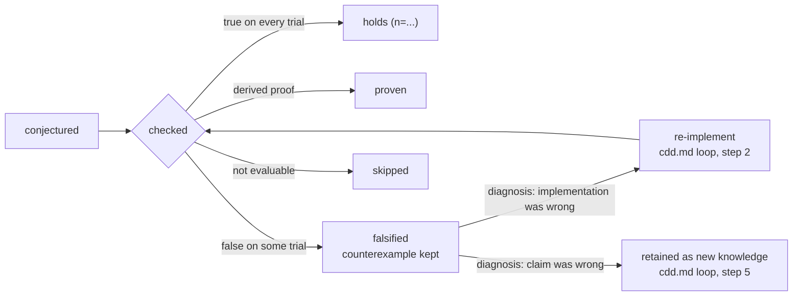

# Claim anatomy

Status: v0.1.0.

A claim about a function `f : A → B` is a four-part structure, and an
adjudication lifecycle status:

- **domain (D)**: which inputs the statement is asserted over, and how,
  e.g. 'over all inputs', 'inputs in a declared range', 'a sampled family'
  (see `declared-schema.md`'s `domain` field). The quantifier, whether the
  claim means "for all," "or only within this range", is nested
  inside the domain rather than a separate element alongside it: a
  domain's exact structure is defined by the grammar that reads it, not
  by this spec.
- **statement (φ)**: the equation or inequality itself, written in some
  expression grammar; a claim states which one (see `declared-schema.md`'s
  `grammar` field), since no single grammar is assumed.
- **tolerance (ε)**: how close counts as equal, for floating-point
  comparison; there's no spec-level default (see `declared-schema.md`'s
  `tolerance` field).
- **evidence route**: how the claim gets checked. Not a fixed set: `probe`
  (seeded random testing against the live function) and `derive` (proof
  against a lifted symbolic form) are the two well-known routes as of
  v0.1, and a tool using a different verification technique is expected to
  name its own rather than force-fit one of these (see `record-schema.md`,
  "Open for extension").

A claim's lifecycle status is what checking it produces:

`skipped` covers a claim that can't be checked at all: the code has effects
that make algebraic probing meaningless, the statement doesn't parse, or its
route isn't one this tool implements. A falsified claim keeps its
counterexample permanently; it is never deleted, and it is never quietly
reverted back to `conjectured` once a diagnosis has been made (see
`cdd.md`'s loop, step 4, "Diagnose," for how that decision gets made).

## Domain: declared vs enforced

A domain condition in a claim (`alpha in (0, 1]`) is a statement about
mathematics: how far the statement is asserted to hold. Whether the code
actually rejects input outside that domain is a statement about
engineering, a different question, checked as its own ordinary claim, not
folded into the first one.

Both live in the ordinary claim shape from `declared-schema.md`, nothing
special-cased:

- The mathematical claim carries a `domain` field, and a checking tool
  samples inside it, so the claim is verified where it's actually claimed
  (in-domain adjudication), not against arbitrary values it was never
  intended for.
- A tool that supports domain-scoped claims may extract a second, ordinary
  claim from the same declaration, asserting that out-of-domain input is
  rejected (`raises(f(alpha))` or similar, see `declared-schema.md`, "Domain
  is a claim field"). Its verdict is `holds` if the code actually rejects
  bad input; what a silent acceptance counts as depends on the checking
  tool's own posture, see `evidence-ladder.md`, "Strict vs lenient
  checking."

## Claim families

Suggested claim families to check: symmetry/intertwining, order, compositional, aggregate/
conservation, asymptotic, structural, domain. Actual implementation is left to the conformant tool. It is expected that these will evolve and future work is expected to create libraries of appropriate reference claims for a given implementation.

### Suggested Claims

**Symmetry / intertwining**: `f(T x) = S(f x)`. The common instances are
even (`f(-x) = f(x)`), odd (`f(-x) = -f(x)`), permutation-invariant
(shuffling a sequence input leaves the result unchanged), scale-equivariant
(`c·f(x) = f(c·x)`), translation-equivariant (`f(x) + c = f(x + c)`). A
conformant tool is expected to check the common instances directly and
accept any other instance of this family (periodic, rotation-invariant,
general `T`/`S`) as a free-form statement over `f` and its parameters.

**Order**: monotone (single-scalar-argument functions) and bounded (for a
sequence argument: `min(x) <= f(x, ...) <= max(x)`). Arbitrary bounds and
contractions are free-form statements in the same shape.

**Compositional**: idempotent (`f(f(x)) = f(x)`, single-argument functions).
Involution and homomorphism statements are expressible as free-form ones.

**Aggregate / conservation** (totals, energy, norms preserved or dominated).
Expressible as a free-form statement where the statement itself computes
the aggregate (for example `sum(x) == sum(f(x))`).

**Asymptotic** (convergence, decay rate, error order, quantified over a
family of inputs rather than a point).

**Structural** (purity, determinism, complexity). Purity and determinism are
cheap to read directly off the code or observe by repeated calls.

**Domain** (domain validity, other parameter constraints)