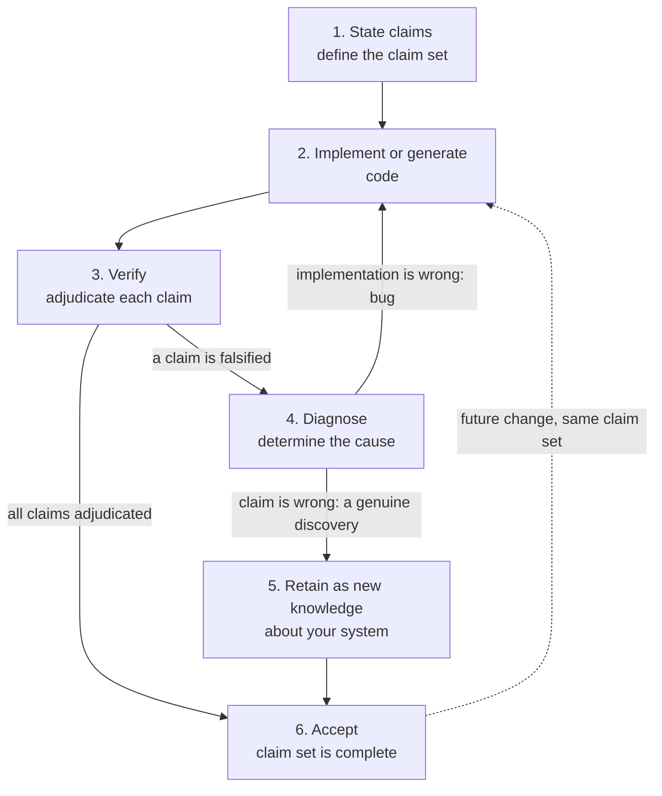

# Claim-Driven Development (CDD)

Status: v0.2.0-draft.

Claim-driven development is a workflow for coding that is primarily written by AI models and reviewed by humans at the critical failure points rather than
reviewed line by line. 

The unit of development is not the
test or the src code but the **claim**: a checkable promise about behavior. A
function should be trusted to the extent of its verified claims.

## The loop

CDD is cyclical. Ideally, claims are first stated, then verifying, diagnosing, and
implementing repeats until the claim set holds. Further development and later code changes
re-enters the cycle at implementation, using the same claim set, without
needing to restate anything.

Notation: `C` is the claim set, `I` the implementation or generated
output, `K` the knowledge base (including discoveries retained from past
falsifications), `r` the reason or evidence behind a falsification. The
loop terminates (reaches step 6, Accept) when every claim has been
adjudicated and nothing is left unresolved: every claim is supported,
or refuted and diagnosed, or carries an explicit human acceptance of the
gap. A claim sitting at `unknown` or `skipped` with nobody having decided
anything about it is the state the loop exists to eliminate, not a
terminal one.

1. **State claims first.** Define the claim set `C`. Written by a human, or
   proposed by an agent for a human to look over. Either way, a claim
   starts as a conjecture, and nothing about where it came from exempts it
   from step 3. This is the one step that should happen once per claim set;
   everything after it can repeat.
2. **Implement, or generate.** Construct the implementation, `I = I(C)`:
   the claim set plus the intent describes what the function must satisfy,
   informing implementation the way a test suite already does in TDD,
   whether a human writes the function by hand or a model generates it.
   CDD doesn't assume the code is AI-written, and it doesn't replace an
   existing test suite: ordinary tests still pin concrete regressions and
   integration behavior, claims add a layer of implementation-independent
   statements on top, and a project can adopt claims incrementally on code
   that already has tests.
3. **Verify.** Adjudicate each claim in `C` against `I`. A mechanical deterministic
   checker, never the claim's own author and never the code's author
   reporting on their own work, runs every claim against the real
   implementation: `proven`, `holds (n=...)` under seeded testing, or `falsified`
   with a counterexample kept permanently. A claim the checker ran and
   could not settle is `unknown`, and one it was blocked on is `skipped`;
   neither is reported as a pass. See `evidence-ladder.md`.
4. **Diagnose.** When a claim comes back falsified, determine the cause;
   there are exactly two, and telling them apart is the actual work of
   this step. Either the implementation is wrong, a bug or an error in the code, and
   the counterexample goes back into step 2 so the loop repeats there, or
   the claim is wrong, a genuine discovery about the problem at hand rather than a
   defect in the code, and moves on to step 5.
5. **Retain as new knowledge.** A claim diagnosed as a genuine discovery
   is kept, permanently, as recorded knowledge: $K = K ∪ {(c, \text{falsified},
   r)}$, the claim, its verdict, and the reason or evidence behind it.
   Not deleted, and not reinterpreted as if it had held all
   along but a counter example to the original thinking (be it human or AI).
6. **Accept.** Once every claim in `C` has been adjudicated, proved or
   falsified, `C` is complete with respect to `I` and `K`. Any
   implementation that re-verifies the same claim set is trusted the same
   as the one before it. A later regeneration re-enters the loop at step
   2 directly and can verify against the existing claim set.

***

 > The **CDD** loop should continue until all falsifications have been resolved either by manual acceptance that the falsification is acceptable (and becomes a known behaviour of the system with the counter-example as a new claim)  or all claims have been verified as *true* (at the given level of evidence).

***

Who typically does what:

| step | who |
|---|---|
| state claims | a human, or an agent proposing claims for human review |
| implement / generate | a human, or an agent; CDD is indifferent to which |
| verify | a mechanical checker only, never the claim's proposer or the code's author self-reporting |
| diagnose | a human, informed by the counterexample; can be mechanical for clear-cut cases |
| retain as new knowledge | mechanical, once a diagnosis has been made |
| accept | a human decision, for any falsified claims |

## What makes a `falsified` verdict trustworthy

A refutation is the strongest thing this loop produces. It sends work
back to step 2, it justifies changing code that may be correct, and it is
retained permanently once diagnosed. Two rules keep it worth that weight,
and both are contracts between tools rather than implementation choices.

**A falsification requires an executed witness.** A claim is only
`falsified` when the tool has a concrete input at which it ran the real
function and saw the claim fail. A symbolic or analytical argument that a
claim must be false is not sufficient on its own: a checker's own
reasoning can be wrong, and a refutation derived but never reproduced is
a statement about the checker, not about the code. A tool that derives a
refutation it cannot reproduce should record `unknown` and say why,
rather than assert a falsification it did not witness.

This is the same discipline the loop already applies to authorship: a
claim's proposer does not get to adjudicate it, and by the same logic a
checker's reasoning does not get to convict the code without the code
being run.

**A retained counterexample is a pin, not a memory.** Once a
counterexample has been recorded, every later adjudication of that claim
replays it before doing any fresh sampling. That is what makes a fix
real: the exact input that failed has to pass, so a bug cannot be closed
by a sampler happening not to look there again. It is also what makes
`invalidated` meaningful, since a regression is detected at the point it
reappears.

## Say what you know, and no more

The method is worth something only because its outputs are calibrated. A
verdict that overstates is worse than no verdict, because a reader who
cannot trust the strong answers has no reason to trust the weak ones
either.

So, as a general rule over everything a conformant tool reports:

> **A tool never reports a stronger epistemic state than it has a basis
> for. Not knowing is spelled out, not defaulted to a confident value.**

Most of this specification is that rule applied to a particular case:

- `holds` is not `proven`, because trials are not a proof;
- `unknown` exists so that "we ran and settled nothing" has somewhere to
  go other than a verdict that implies it was checked;
- a falsification needs a witness the code was actually run at;
- a structural fact the tool could not establish is reported as unknown
  rather than guessed (`verified-schema.md`'s `identity.pure` is the
  worked example: `null`, not `false`, and certainly not `true`);
- an acceptance lapses when the code it was about changes, because it was
  never a decision about this code.

The rule binds wherever a tool has the option of saying nothing and says
something instead. It is the one thing in this document that a tool
cannot be conformant while ignoring, whatever else it chooses to record.

## Additive-only vocabularies

Several fields in this specification are open strings rather than closed
enums, so that a tool doing something new can name it honestly. That
freedom depends on one discipline: **a released value is never renamed
and never repointed at a different meaning. New meaning, new value.**

A renamed value breaks every record that used it. A repointed one is
worse: nothing breaks, and the meaning changes underneath a store nobody
re-read. See `record-schema.md`, "Open vocabularies are additive only."

## Alongside a normal test suite

A test suite is implementation-specific: concrete inputs, wiring,
integration, this particular code's regressions. Claims are
implementation-independent: what any correct implementation must satisfy, so
they survive the rewrite and the port. Claims generate tests; counterexamples
become permanent regression anchors. CDD builds directly on top of property-based
testing and promotes statements from a testing technique
to the primary artifact of development.

## Prefer pure functions

Purity is what makes a claim checkable by more than example: a pure
function can be probed reproducibly and compared across implementations,
the same property that let purely functional programming languages reason
about programs long before AI-written code made it a pressing requirement.

CDD rewards the functional-core, imperative-shell shape, pushing effects to
the edges and keeping the meaning in the middle, but this is a reward, not
a requirement: it doesn't exclude OOP or any other style, and it doesn't
ask you to eliminate side effects where they're genuinely necessary. Impure
functions still get a record, won't necessarily work for them.

## Claim coverage, in addition to code coverage

A claim-coverage report shows how
much behavior is pinned down per function (proven + held + falsified,
versus skipped/unverifiable), not which lines ran. Unclaimed behavior is a
degree of freedom given to the AI model in how it develops and becomes the risk surface of the generated
codebase, **CDD** makes this more measurable.

Refutation counts as coverage, not necessarily as a failure by
itself: a falsified claim can still be useful knowledge about the bounds
and behavior of a function. This is different from TDD, where the loop
aims to make every test pass; CDD is about understanding a conjecture,
which sometimes means understanding exactly how and why it's false. 

Tests check implementation, claims check that the intent matches reality.

## Glossary

Every term used across this repo, linked from here.

- **claim**: a checkable promise
  about behavior, the unit of development in CDD. A **conjecture** is a not-yet verified claim.
  [`claim-anatomy.md`](claim-anatomy.md).
- **claim set (`C`)**: every claim currently asserted about an
  implementation. [The loop](#the-loop).
- **statement (`φ`)**: the equation or inequality a claim asserts, written
  in some expression grammar; the same field, unchanged, in both the
  declared and verified shapes. [`claim-anatomy.md`](claim-anatomy.md);
  [declared-schema.md, "This YAML is the interchange
  shape"](declared-schema.md#this-yaml-is-the-interchange-shape-not-the-only-way-to-author-a-claim).
- **domain (`D`)**: the actual region of input space a restricted
  quantifier refers to, for example `alpha in (0, 1]`, the *bounds*
  themselves, not the choice to restrict. [`claim-anatomy.md`](claim-anatomy.md);
  [`declared-schema.md`'s `domain`
  field](declared-schema.md#domain-is-a-claim-field-not-a-separate-mechanism).
- **tolerance (`ε`)**: how close counts as equal, for floating-point
  comparison. [`claim-anatomy.md`](claim-anatomy.md);
  [declared-schema.md, "Tolerance has no
  default"](declared-schema.md#tolerance-has-no-default-and-is-left-to-the-implementation).
- **evidence route**: how a claim gets checked, `probe` and `derive` are the
  two well-known routes, open to others. [`claim-anatomy.md`](claim-anatomy.md);
  [declared-schema.md, "Route defaults to
  `probe`"](declared-schema.md#route-defaults-to-probe).
- **verdict**: the outcome of checking a claim: `proven`, `holds`,
  `documented`, `declared`, `unknown`, `falsified`, `invalidated`,
  `skipped`. [`evidence-ladder.md`](evidence-ladder.md).
- **stance**: the coarse bucket a verdict folds into for counting,
  `supported`, `refuted`, `blocked` or `undecided`.
  [evidence-ladder.md, "Rolling verdicts up"](evidence-ladder.md).
- **premise**: what a claim assumes, when it is true only under a side
  condition. Part of the claim, not a narrowing of it.
  [`claim-anatomy.md`](claim-anatomy.md).
- **canonical form**: the one rendering of a claim's text that a grammar
  designates, so two tools agree on the claim's identity. Defined by the
  grammar, not by this specification. [record-schema.md, "Claim identity
  belongs to the grammar"](record-schema.md).
- **declared shape / declared layer**: how a claim set is proposed, before
  verification, intermediary and disposable. [record-schema.md, "Declared vs
  verified"](record-schema.md#declared-vs-verified); the shape itself is
  [`declared-schema.md`](declared-schema.md).
- **verified shape / verified layer**: what a conformant tool writes after
  actually checking a declared claim set, the artifact that persists.
  [record-schema.md, "Declared vs verified"](record-schema.md#declared-vs-verified);
  the shape itself is [`verified-schema.md`](verified-schema.md).
- **`authored`**: traces a verified claim back to where it was proposed, a
  file, a person, an agent, a tool. [verified-schema.md, "Tracing a claim back
  to where it was
  authored"](verified-schema.md#tracing-a-claim-back-to-where-it-was-authored).
- **`accepted`**: whether a falsified claim was diagnosed as a bug or as
  genuine retained knowledge, and who made that call.
  [`verified-schema.md`](verified-schema.md).
- **`intent`**: why the function exists; declared (proposed, pre-check) or
  documented (read from the docstring, post-check), with the docstring
  winning when both exist and disagree. [record-schema.md, "Where `intent`
  comes from"](record-schema.md#where-intent-comes-from).
- **`grammar`**: which expression dialect a claim's statement is written in.
  [declared-schema.md, "Grammar"](declared-schema.md#grammar).
- **`meta`**: an open, namespaced extension point for anything the core
  schema doesn't name. [record-schema.md, "The `meta` extension
  point"](record-schema.md#the-meta-extension-point).
- **identity (`form` / `sig`)**: two hashes answering different questions,
  "same implementation" and "same interface." [`verified-schema.md`](verified-schema.md).
- **`lineage.spec_version`**: which version of this spec a record conforms
  to. [`verified-schema.md`](verified-schema.md).
- **append-only membership**: an adjudicated claim leaves the live list
  only by being superseded, retained as a discovery, or marked
  historical, and is retained in every case.
  [record-schema.md, "Claim membership is append-only"](record-schema.md).
- **claim coverage**: how much behavior is pinned down per function,
  counted alongside test coverage. [Claim coverage, in addition to
  code coverage](#claim-coverage-in-addition-to-code-coverage).

## See also

The claim tuple: `claim-anatomy.md`.
The YAML wire format for stating and recording claims: `record-schema.md`
(`declared-schema.md` and `verified-schema.md` for the two shapes
themselves).
The verdict vocabulary and what each verdict means in terms of its evidence:
`evidence-ladder.md`.
